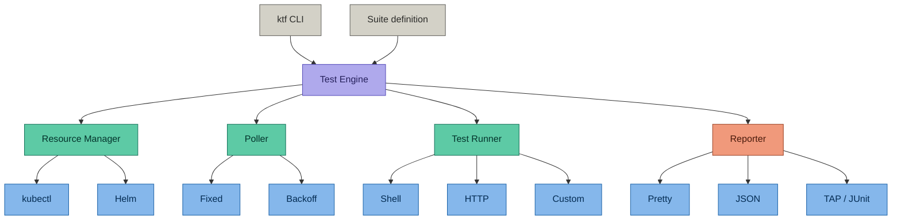

# architecture overview

```mermaid
graph TD
    CLI["ktf CLI"]
    Engine["Test Engine"]

    CLI --> Engine

    Engine --> RM["Resource Manager"]
    Engine --> PL["Poller"]
    Engine --> TR["Test Runner"]
    Engine --> RP["Reporter"]

    RM --> kubectl["kubectl"]
    RM --> helm["Helm"]

    PL --> fixed["Fixed"]
    PL --> backoff["Backoff"]

    TR --> shell["Shell"]
    TR --> http["HTTP"]
    TR --> custom["Custom"]

    RP --> pretty["Pretty"]
    RP --> json["JSON"]
    RP --> tap["TAP / JUnit"]

    Config["Suite definition"]
    Config --> Engine

    style CLI fill:#D3D1C7,stroke:#5F5E5A,color:#2C2C2A
    style Engine fill:#AFA9EC,stroke:#534AB7,color:#26215C
    style RM fill:#5DCAA5,stroke:#0F6E56,color:#04342C
    style PL fill:#5DCAA5,stroke:#0F6E56,color:#04342C
    style TR fill:#5DCAA5,stroke:#0F6E56,color:#04342C
    style RP fill:#F0997B,stroke:#993C1D,color:#4A1B0C
    style kubectl fill:#85B7EB,stroke:#185FA5,color:#042C53
    style helm fill:#85B7EB,stroke:#185FA5,color:#042C53
    style fixed fill:#85B7EB,stroke:#185FA5,color:#042C53
    style backoff fill:#85B7EB,stroke:#185FA5,color:#042C53
    style shell fill:#85B7EB,stroke:#185FA5,color:#042C53
    style http fill:#85B7EB,stroke:#185FA5,color:#042C53
    style custom fill:#85B7EB,stroke:#185FA5,color:#042C53
    style pretty fill:#85B7EB,stroke:#185FA5,color:#042C53
    style json fill:#85B7EB,stroke:#185FA5,color:#042C53
    style tap fill:#85B7EB,stroke:#185FA5,color:#042C53
    style Config fill:#D3D1C7,stroke:#5F5E5A,color:#2C2C2A
```
